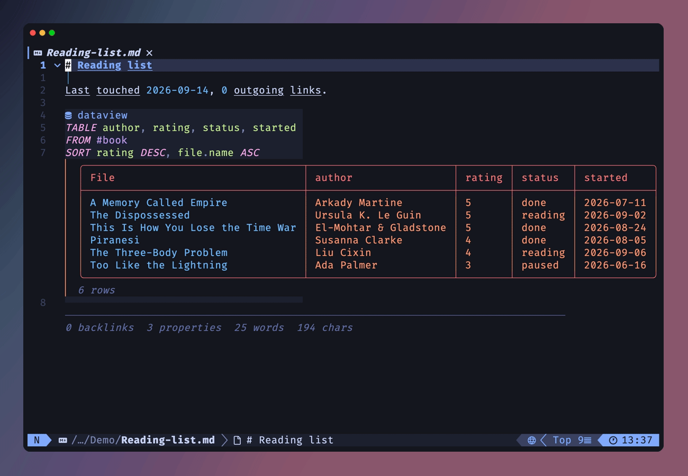
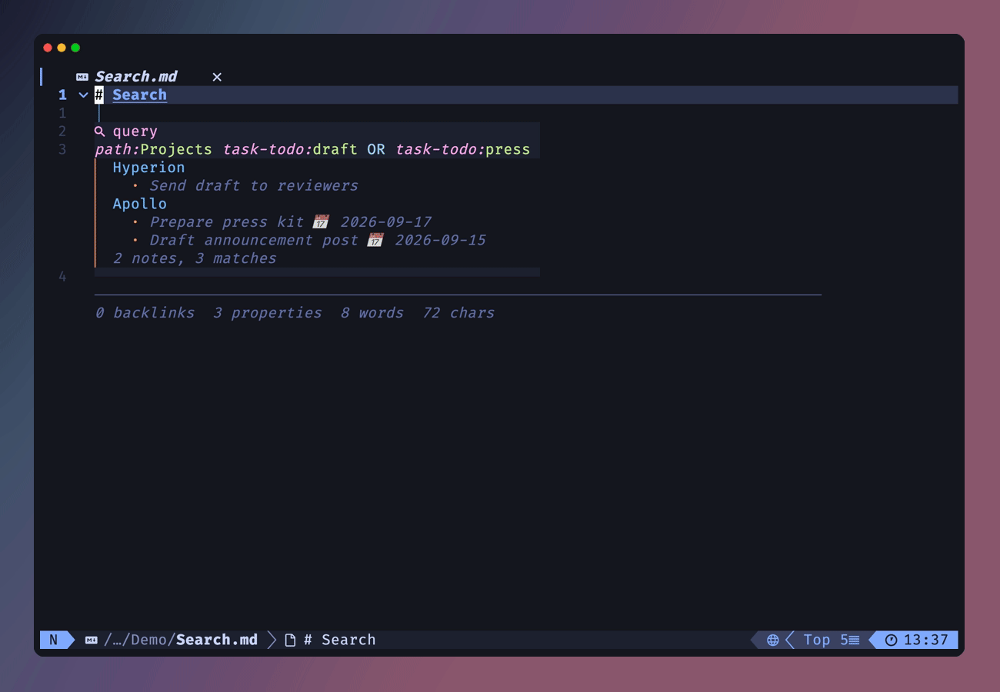
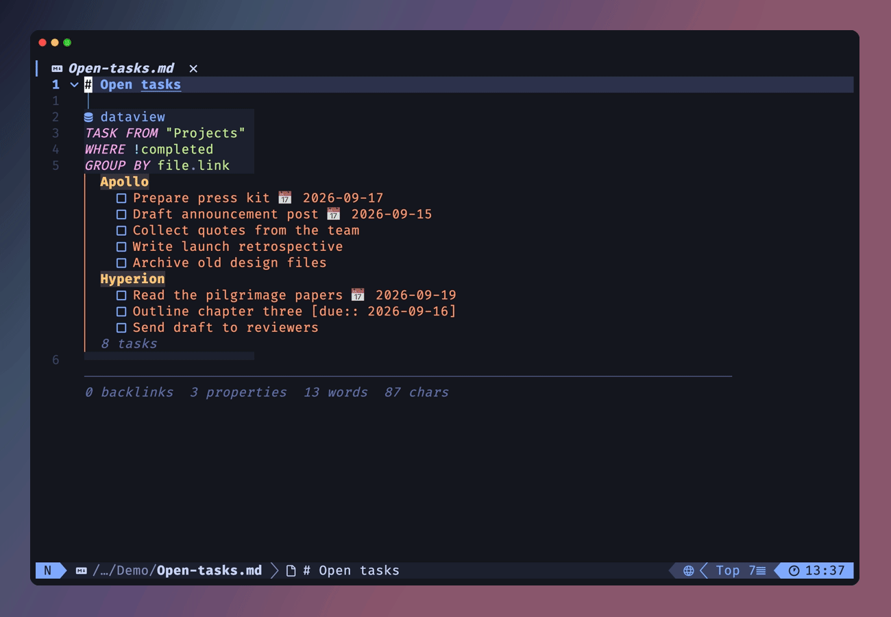
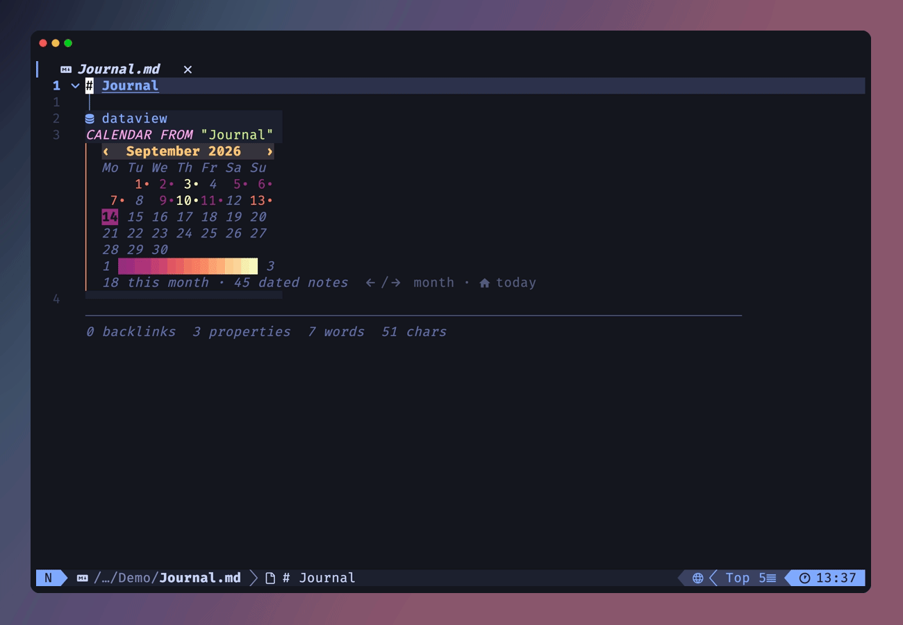
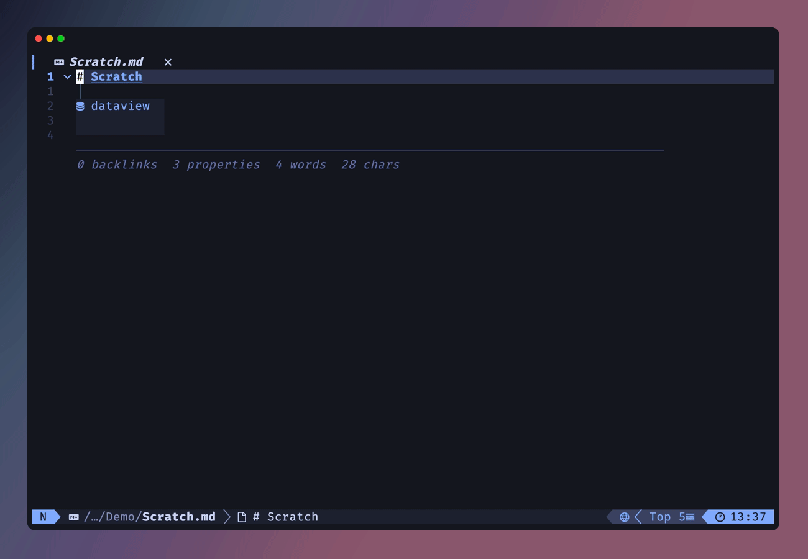

<h1 align="center">obsidian-query.nvim</h1>

<p align="center">
  Live <a href="https://obsidian.md">Obsidian</a> queries inside Neovim — no Obsidian required.
</p>

<p align="center">
  <a href="https://github.com/dpezto/obsidian-query.nvim/actions/workflows/ci.yml"></a>
  
  
  
</p>

<p align="center">
  
</p>

Renders Obsidian's `query` (core [Search](https://help.obsidian.md/plugins/search)) and `dataview`
([Dataview](https://github.com/blacksmithgu/obsidian-dataview) DQL) code fences as inline results,
exactly where Obsidian would render them. Both query languages are re-implemented in pure Lua and
evaluated against your vault's markdown files, so results are always live — Obsidian never runs.

Results are drawn as virtual lines: they appear in normal mode and collapse back to the raw fence
while you edit. Your files on disk only ever contain the query.

## What it does — and doesn't

| ✅ Supported                                                        | ❌ Out of scope                                            |
| ------------------------------------------------------------------- | ---------------------------------------------------------- |
| ` ```query ` fences — the full core-Search language                 | `dataviewjs` fences (JavaScript, needs Obsidian's runtime) |
| ` ```dataview ` fences — DQL `TABLE` / `LIST` / `TASK` / `CALENDAR` | `$=` inline JS                                             |
| Inline `` `= expr` `` queries in prose                              | Dataview settings (custom date formats, result limits…)    |
| Result pickers, calendar navigation, task toggling                  | Vaults not managed by obsidian.nvim                        |
| Context-aware completion (blink.cmp)                                | Timezones / millisecond dates                              |
| Fence syntax highlighting, multi-vault support                      |                                                            |

## Features

### Dataview fences

DQL `TABLE` / `LIST` / `TASK` / `CALENDAR` with `FROM` / `WHERE` / `SORT` / `GROUP BY` /
`FLATTEN` / `LIMIT`, a full expression language with lambdas, ~60 functions, typed
dates/durations/links, implicit `file.*` fields, inline `Key:: value` fields, tasks with
`[due:: …]` and Tasks-plugin emoji dates (📅 ✅ ➕ ⏳ 🛫), and `FROM csv("data.csv")`.

### Search fences

The full core-Search query language: terms, `"phrases"`, `/regex/`, `OR` / `-` / `(...)`,
`tag:` `path:` `file:` `content:` `line:()` `section:()` `block:()` `task:` `[property]`,
smart case. Matched lines render under each note. Like Obsidian, every vault file is matchable
by `path:` / `file:` / bare filename — attachments included; content operators only ever hit notes.



### Interactive results

`<CR>` on any fence opens the result set in your picker — jumping to exact lines for content
matches and tasks. [snacks.nvim](https://github.com/folke/snacks.nvim),
[telescope.nvim](https://github.com/nvim-telescope/telescope.nvim) and
[fzf-lua](https://github.com/ibhagwan/fzf-lua) are supported (auto-detected in that order),
with `vim.ui.select` as the no-plugin fallback. In TASK pickers, `<C-t>` toggles the selected
task's checkbox in its file and updates the row live.



### Calendar heat map

`CALENDAR` renders one month at a time, opening on the current month. Navigate with
`<Left>`/`<Right>` (or the `‹` `›` header arrows), jump back with `<Home>` (or the month label),
click a day for that day's notes. Days are heat-mapped by note count on a continuous color ramp
clipped to a contrast floor against your colorscheme's background, with a grid-wide legend
(`1 ██████ 6`) mapping colors back to counts. Today is drawn reversed.



### Completion

An optional [blink.cmp](https://github.com/Saghen/blink.cmp) source offering context-aware
operators, DQL keywords and functions with inline documentation, plus your vault's tags,
folders, note names and frontmatter properties.



### Inline queries

`` `= this.file.mtime` `` in prose renders its value as inline virtual text; the raw span
reappears on the cursor line for editing.

### Syntax highlighting

Both fence languages are highlighted by the same lexers that execute the queries — what
highlights is exactly what parses.

## Requirements

| Dependency                                                                                                                                                                | Why                                                                                                                                 | Required                               |
| ------------------------------------------------------------------------------------------------------------------------------------------------------------------------- | ----------------------------------------------------------------------------------------------------------------------------------- | -------------------------------------- |
| Neovim ≥ 0.11                                                                                                                                                             |                                                                                                                                     | ✅                                     |
| [obsidian.nvim](https://github.com/obsidian-nvim/obsidian.nvim) (community fork)                                                                                          | vault/workspace management; its cache is the dataview engine's metadata index                                                       | ✅ (with `cache = { enabled = true }`) |
| [render-markdown.nvim](https://github.com/MeanderingProgrammer/render-markdown.nvim)                                                                                      | the custom-handler API that puts results on screen                                                                                  | ✅                                     |
| [snacks.nvim](https://github.com/folke/snacks.nvim) / [telescope.nvim](https://github.com/nvim-telescope/telescope.nvim) / [fzf-lua](https://github.com/ibhagwan/fzf-lua) | result pickers — any one of them; without one, results open via `vim.ui.select` (no preview, no `<C-t>` toggle)                     | recommended                            |
| [ripgrep](https://github.com/BurntSushi/ripgrep)                                                                                                                          | supplemental index (inline fields, headers, backlinks) — already required by obsidian.nvim                                          | ✅                                     |
| a Nerd Font                                                                                                                                                               | key glyphs in result hints, task checkboxes — set `icons = "ascii"` (or `vim.g.have_nerd_font = false`) to use plain-text fallbacks | optional                               |
| [blink.cmp](https://github.com/Saghen/blink.cmp)                                                                                                                          | completion source                                                                                                                   | optional                               |

## Installation

With [lazy.nvim](https://github.com/folke/lazy.nvim):

```lua
{
  "dpezto/obsidian-query.nvim",
  ft = "markdown",
},
{
  "MeanderingProgrammer/render-markdown.nvim",
  -- function form: a require() in a plain opts table would run when the spec
  -- file is sourced and load obsidian-query at startup
  opts = function(_, opts)
    -- this wiring is what puts results on screen
    opts.custom_handlers = {
      markdown = require("obsidian-query").handler,
      -- optional: inline `= expr` queries in prose
      markdown_inline = require("obsidian-query.inline").handler,
    }
  end,
},
```

Make sure obsidian.nvim has its cache enabled:

```lua
require("obsidian").setup({ cache = { enabled = true }, --[[ ... ]] })
```

Then run `:checkhealth obsidian-query` — it probes every external coupling (ripgrep,
treesitter, render-markdown API, obsidian.nvim cache schema and workspace match, and which
picker backend resolved).

<details>
<summary><b>Longhand handler wiring</b> (if you need to compose with your own handlers)</summary>

`require("obsidian-query").handler` is just `{ extends = true, parse = ... }`. The explicit form:

```lua
custom_handlers = {
  markdown = {
    extends = true, -- keep render-markdown's builtin handlers running
    parse = function(ctx)
      return require("obsidian-query").parse(ctx)
    end,
  },
  markdown_inline = {
    extends = true,
    parse = function(ctx)
      return require("obsidian-query.inline").parse(ctx)
    end,
  },
},
```

</details>

<details>
<summary><b>Fence label icons</b> (mini.icons users)</summary>

render-markdown looks the fence label icon up by language string through your icon provider.
With **nvim-web-devicons** the plugin registers `dataview`/`query` icons automatically. With
**mini.icons** there is no registration API (it is config-only by design), so add them to your
own setup:

```lua
require("mini.icons").setup({
  filetype = {
    dataview = { glyph = "󰆼", hl = "MiniIconsBlue" },
    query = { glyph = "󰍉", hl = "MiniIconsPurple" },
  },
})
```

</details>

<details>
<summary><b>blink.cmp source</b> (optional completion)</summary>

```lua
sources = {
  per_filetype = { markdown = { inherit_defaults = true, "obsidian_query" } },
  providers = {
    obsidian_query = { name = "ObsidianQuery", module = "obsidian-query.blink" },
  },
}
```

</details>

## Configuration

Defaults (calling `setup()` is only needed to change them; lazy.nvim's `opts = {}` does it for you):

```lua
require("obsidian-query").setup({
  picker = {
    -- "auto": first available of snacks > telescope > fzf-lua, falling back
    -- to vim.ui.select. Or pin one: "snacks" | "telescope" | "fzf-lua" | "select".
    backend = "auto",
    -- "file": plain file rows (snacks' stock formatter / paths elsewhere).
    -- "rich": query-shaped rows — dates, table cells, source note + task text.
    style = "file",
  },
  -- "auto": nerd-font glyphs unless vim.g.have_nerd_font == false.
  -- "ascii" forces plain-text key hints (<CR>) and raw checkboxes ([x]/[ ]/[-]).
  -- Task glyphs come from render-markdown's own `checkbox` config — its
  -- `unchecked`/`checked` icons plus any `custom` entry (e.g. raw = "[-]"), so
  -- results match the checkboxes in the buffer. States it has no entry for get
  -- the list bullet plus the raw char (● ~), the same way the buffer shows them.
  icons = "auto",
  -- Cap inline-rendered rows/notes/tasks; excess becomes a "+N more — 󰌑 for all"
  -- line (the <CR> picker always holds the full set). nil = unlimited — beware:
  -- the cursor can't enter virtual lines, so j/k jump across the whole block.
  max_inline_rows = 12,
})
```

Backend notes: previews and the live `<C-t>` row update are richest on snacks; telescope gets
a quickfix-style preview and full toggling; fzf-lua jumps and toggles but shows no preview and
refreshes toggled rows on the next open; `vim.ui.select` only jumps.

### Keymaps

Buffer-local to vault notes, set automatically when a note is entered (on obsidian.nvim's
`ObsidianNoteEnter` event). Every mapping falls through to its normal behavior when the cursor
isn't on a query:

| Mapping              | On a query                                                                                                                      | Elsewhere                                 |
| -------------------- | ------------------------------------------------------------------------------------------------------------------------------- | ----------------------------------------- |
| `<CR>`               | Open results in a picker, titled by query kind and source — `TABLE · "Coding" (24)`                                             | obsidian.nvim's `smart_action`, unchanged |
| `<LeftMouse>`        | Calendar day with notes → picker of that day's notes (`Notes · 2026-07-29`); `‹`/`›` arrows → change month; month label → today | normal click                              |
| `<Left>` / `<Right>` | Calendar: previous/next month                                                                                                   | unchanged                                 |
| `<Home>`             | Calendar: back to the current month                                                                                             | unchanged                                 |
| `<C-t>`              | Inside a TASK picker: toggle the selected task's checkbox in its file                                                           | —                                         |

There is currently no opt-out or remap option for these — open an issue if you need one.

### Multiple vaults

Results always follow the buffer, not the globally active workspace. Opening a note from
another vault switches obsidian.nvim's active workspace to it, rebuilds the metadata cache for
that vault (obsidian.nvim only wires its cache at startup), marks all cached query results
stale, and re-renders — queries never show a different vault's results.

## Query language reference

<details>
<summary><b>Search fences</b> — complete core-Search syntax</summary>

Words, `"phrases"`, `/regex/`, implicit AND, `OR`, `-` negation, `(...)` grouping, and:

| Operator                                 | Matches                                                       |
| ---------------------------------------- | ------------------------------------------------------------- |
| `file:`                                  | file name (any vault file, attachments included)              |
| `path:`                                  | full path                                                     |
| `content:`                               | note body                                                     |
| `tag:`                                   | frontmatter and inline tags, nested (`#a/b` matches `tag:#a`) |
| `line:(...)`                             | all terms on one line                                         |
| `section:(...)`                          | all terms under one heading                                   |
| `block:(...)`                            | all terms in one block (paragraph/list item)                  |
| `task:` / `task-todo:` / `task-done:`    | task text, optionally filtered by state                       |
| `match-case:(...)` / `ignore-case:(...)` | case override for the group                                   |
| `[property]` / `[property:value]`        | frontmatter property existence / value                        |

Matching is smart-case, like Obsidian: lowercase terms match case-insensitively, any uppercase
makes the term case-sensitive.

</details>

<details>
<summary><b>Dataview fences</b> — DQL</summary>

**Headers**: `TABLE [WITHOUT ID]`, `LIST [WITHOUT ID]`, `TASK`, `CALENDAR`

**Sources**: `#tag` (nested), `"folder"`, `[[note]]` (inlinks), `outgoing([[note]])`,
`csv("file.csv")`, combined with `AND` / `OR` / `-`

**Commands**: `WHERE`, `SORT` (multi-key), `GROUP BY`, `FLATTEN`, `LIMIT` — executed in
written order, duplicates allowed, matching Dataview.

**Expressions**: arithmetic with typed values (`date - date` → duration, `date + dur(1 month)`
shifts the calendar month with day clamping), comparisons with Dataview's null semantics,
`AND` / `OR` / `!`, lambdas (`(x) => ...`), list literals, `[[link]]` literals, contextual
`date(2026-01-01)` / `date(today|sow|som|…)` / `dur(30 days)` literals.

**Implicit fields**: `file.name` `folder` `path` `link` `size` `ctime` `cday` `mtime` `mday`
`day` `tags` `etags` `aliases` `tasks` `lists` `inlinks` `outlinks` `frontmatter` `starred`
(bookmarks); frontmatter keys are available under their original, lowercase, and kebab-case
names; inline `Key:: value` fields (repeated keys merge into arrays).

**Tasks**: `text` `status` `checked` `completed` `fullyCompleted` `line` `section` `children`
`parent`, `[due:: …]`-style fields and 📅 ✅ ➕ ⏳ 🛫 emoji dates, indent-based nesting.

**Functions** (62, see `lua/obsidian-query/dataview/functions.lua`):

| Category           | Functions                                                                                                                                                  |
| ------------------ | ---------------------------------------------------------------------------------------------------------------------------------------------------------- |
| Constructors       | `array` `date` `dur` `elink` `embed` `link` `list` `number` `object` `string` `typeof`                                                                     |
| Numeric            | `average` `ceil` `floor` `max` `min` `round` `sum` `trunc`                                                                                                 |
| Strings            | `containsword` `endswith` `lower` `padleft` `padright` `replace` `split` `startswith` `substring` `trim` `truncate` `upper`                                |
| Regex              | `regexmatch` `regexreplace` `regextest`                                                                                                                    |
| Lists              | `all` `any` `contains` `econtains` `filter` `first` `flat` `join` `last` `length` `map` `maxby` `minby` `none` `nonnull` `reverse` `slice` `sort` `unique` |
| Dates & formatting | `currencyformat` `dateformat` `durationformat` `localtime` `striptime`                                                                                     |
| Misc               | `choice` `default` `extract` `hash` `meta`                                                                                                                 |

**Regex** (both `/regex/` search terms and the `regex*` functions) is translated to Vim regex:
alternation, `{n,m}`, character classes, `\b`, non-capturing groups and all four lookarounds
work; `$1` backreferences work in replacements. Patterns with in-pattern backreferences, named
groups or inline flags are rejected with a one-time warning.

</details>

## Recipes

A reading list from frontmatter:

````markdown
```dataview
TABLE author, rating, status, started
FROM #book
SORT rating DESC, file.name ASC
```
````

Open tasks due this week, grouped by note:

````markdown
```dataview
TASK FROM "Projects"
WHERE !completed AND due AND due <= date(eow)
GROUP BY file.link
```
````

Recently modified notes in a folder:

````markdown
```dataview
TABLE status, created AS "Started"
FROM "Journal"
WHERE file.mtime >= date(today) - dur(30 days)
SORT file.name DESC
LIMIT 10
```
````

Daily-notes activity as a heat-mapped calendar:

````markdown
```dataview
CALENDAR FROM "Journal"
```
````

External data from a CSV in the vault:

````markdown
```dataview
TABLE score, when FROM csv("measurements.csv") SORT score DESC
```
````

Full-text search with operators:

````markdown
```query
path:Areas/Work tag:#project "kickoff meeting"
```
````

Inline, mid-sentence:

```markdown
This note has `= length(this.file.tasks)` tasks, last touched `= this.file.mday`.
```

## How it works

<details>
<summary>Parsing, evaluation, rendering, caching</summary>

- **Parsing** — a treesitter query finds `query`/`dataview` fences; each engine parses its body
  with a recursive-descent parser. Evaluation is total: malformed input renders an error line
  (fences) or nothing (inline) — never a Lua error.
- **Evaluation** — the search engine reads candidate notes directly. The dataview engine builds
  page objects from obsidian.nvim's mtime-checked cache plus its own ripgrep-backed supplemental
  index (inline fields, headers, backlinks, bookmarks). Queries run async; a pending fence shows
  a dimmed `…` placeholder.
- **Caching** — results are memoized per query + vault, invalidated when any vault note is
  written or entered, and when the workspace switches.
- **Rendering** — results are `virt_lines` extmarks drawn through render-markdown's
  custom-handler API, anchored above the line after the fence to cooperate with
  render-markdown's fence concealing. Re-renders use an exponential backoff that survives
  render-markdown's debounce window.
- **Highlighting** — fence bodies are colored by the same lexers that execute the queries.
- The calendar's heat ramp is sampled from palette anchors, clipped to a contrast floor against
  your colorscheme's `Normal` background, and rebuilt on `:colorscheme`. Override any step with
  `ObsidianQueryHeat1`…`ObsidianQueryHeat24`, or the today marker with `ObsidianQueryToday`.

</details>

## Limitations

- No `dataviewjs` and no `$=` inline JS — that is JavaScript and needs Obsidian's runtime.
- Array indexing is 1-based (Lua convention; Dataview's is 0-based).
- Dates are naive local time — no timezones or millisecond precision.
- Plain items in `file.lists` carry no `children`/`parent` nesting (tasks do).
- Regex patterns with in-pattern backreferences, named groups or inline flags are rejected
  (one-time warning; the pattern matches nothing).
- Results are virtual lines: the cursor cannot enter them — use the `<CR>` picker, where
  `<C-t>` toggles TASK checkboxes.

## Development

```sh
nvim -l tests/search_spec.lua
nvim -l tests/dataview_spec.lua
```

Plain-assert suites (300+ checks), no framework, no fixtures on disk. Specs strip the user
config from `runtimepath` so they always exercise this repo's tree.

The README GIFs are recorded with [vhs](https://github.com/charmbracelet/vhs) against a
throwaway vault — see [`assets/demo/README.md`](assets/demo/README.md).

## Credits

- [blacksmithgu/obsidian-dataview](https://github.com/blacksmithgu/obsidian-dataview) — the
  Dataview plugin this re-implements, and the reference for DQL semantics.
- [Obsidian Search](https://help.obsidian.md/plugins/search) — the core plugin behind `query` fences.
- [obsidian-tasks](https://github.com/obsidian-tasks-group/obsidian-tasks) — the emoji date format.
- [obsidian.nvim](https://github.com/obsidian-nvim/obsidian.nvim),
  [render-markdown.nvim](https://github.com/MeanderingProgrammer/render-markdown.nvim),
  [snacks.nvim](https://github.com/folke/snacks.nvim) — the stack this plugin builds on.
